# 🧠 ML Integration Plan: Transforming "Wrapper" to "Intelligent Platform"

## 🎯 Objective
To upgrade the **Multi-AI Parallel Reasoning Platform** from a simple API wrapper into a sophisticated **ML-powered benchmarking tool**. This will demonstrate core ML Engineering skills: **NLP, Vector Embeddings, Microservices, and System Design**.

## 🌟 Unique Selling Proposition (USP)
**"Comparative RAG & Intelligent Routing"**
Most platforms let you chat with *one* model about a document. Your platform will be the **first to let users benchmark how DIFFERENT models interpret the SAME document context simultaneously.**

---

## 🚀 Proposed ML Features

### 1. 🧠 Smart Prompt Router (Intent Classification)
**The "Brain" of the system.**
- **Function**: Analyzes the user's prompt *before* sending it.
- **ML Task**: Text Classification (Zero-shot or Fine-tuned BERT).
- **Output**: Detects intent (e.g., `Coding`, `Creative Writing`, `Math/Logic`, `General`).
- **UX**: Automatically highlights/selects the best model for the job (e.g., "Detected **Coding** task → Recommending **Phi-4**").
- **Why for ML Profile?**: Shows you can deploy NLP models for practical decision making.

### 2. 📚 Comparative RAG (Retrieval Augmented Generation)
**The "Knowledge" of the system.**
- **Function**: Users upload a PDF/Text file.
- **ML Task**:
    - **Embeddings**: Use `sentence-transformers` (e.g., `all-MiniLM-L6-v2`) to convert text to vectors.
    - **Vector Search**: Use `FAISS` or `ChromaDB` to retrieve relevant chunks.
- **UX**: The retrieved context is injected into *all* active models. Users can see which model utilizes the context best.
- **Why for ML Profile?**: RAG is the #1 most demanded skill in GenAI right now.

### 3. 📊 Response Analytics (The "Judge")
**The "Analyst" of the system.**
- **Function**: Analyze the *responses* coming back from the models.
- **ML Task**: Sentiment Analysis or Complexity Scoring (Flesch-Kincaid or ML-based).
- **UX**: Display a "Complexity Score" or "Sentiment Badge" next to each response.

---

## 🏗️ Technical Architecture Changes

To show you are a true ML Engineer, we will move beyond just Node.js and add a **Python Microservice**.

### **Current Stack**
`React (Frontend)` ↔ `Node.js (Proxy)` ↔ `NVIDIA API`

### **New ML-Powered Stack**

```mermaid
graph TD
    User[User Interface] --> Node[Node.js Proxy]
    Node --> NVIDIA[NVIDIA API]
    Node -- Analysis Request --> Python[🐍 Python FastAPI Service]
    
    subgraph "ML Microservice (Python)"
        Python --> BERT[DistilBERT Classifier]
        Python --> Embed[Sentence Transformers]
        Python --> FAISS[Vector DB]
    end
```

**Why this architecture?**
- **Decoupling**: Keeps the heavy ML lifting separate from the lightweight web server.
- **Python Ecosystem**: Gives access to PyTorch, HuggingFace, Scikit-learn.
- **Scalability**: Standard pattern in enterprise ML systems.

---

## 📅 Implementation Steps

### Phase 1: The Python Microservice Setup
1.  Create `ml_service/` directory.
2.  Setup **FastAPI** (high performance Python web framework).
3.  Create a basic `/health` endpoint.

### Phase 2: Smart Router (Intent Classifier)
1.  Integrate `transformers` library.
2.  Load a lightweight Zero-Shot classifier (e.g., `facebook/bart-large-mnli` or a smaller distilled version).
3.  Create endpoint `/classify_intent`.
4.  **Frontend**: Call this endpoint on user input -> Show "Recommended Model" badge.

### Phase 3: Comparative RAG (The Big USP)
1.  Add file upload support to Frontend & Node.
2.  **Python**: Implement `LangChain` or raw `sentence-transformers` to chunk and embed text.
3.  **Python**: Store in in-memory `FAISS` index.
4.  **Node**: Before calling NVIDIA, call Python to get `relevant_context`.
5.  **Node**: Inject context into the system prompt for NVIDIA models.

---

## 💼 How to Pitch This on Your Resume

> "Designed and engineered a **Multi-Model RAG Benchmarking Platform**.
> *   **Architecture**: Decoupled Microservices (React/Node/FastAPI).
> *   **NLP**: Implemented BERT-based intent classification to dynamically route queries to specialized LLMs.
> *   **RAG**: Built a comparative vector search engine using FAISS and Sentence-Transformers to evaluate hallucination rates across multiple LLMs simultaneously."

---

## ❓ User Decision Required

Do you want to proceed with:
1.  **Full Suite (Router + RAG)**: The most impressive portfolio piece.
2.  **Router Only**: Faster to implement, focuses on NLP classification.
3.  **RAG Only**: Focuses purely on GenAI/Vector search.

*I recommend **Option 1** or **Option 3** for the strongest profile impact.*
